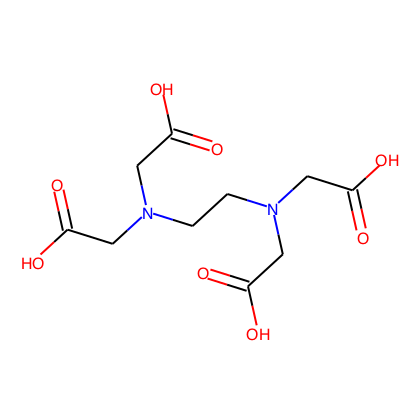

# Chem bot

## Install

Clone this repo.

```
git clone https://github.com/kubor/chem_bot.git
```

Prepare conda environment.  
If you want to run chem_bot on docker, [see below description](#docker).

```
cd chem_bot
conda env create -n chem_bot -f environment.yml
```

Activate conda environment.

```
source activate chem_bot
```

Install `chem_bot`.

Run pip command at `chem_bot` directory.

```
python setup.py install
```

## <a name="docker"/> chem_bot on Docker

After clone repository build docker image.

```
cd chem_bot
docker build -t chem_bot .
```

Then, run docker with `-it` and `bash`.

```
docker run -it chem_bot bash
```

## Usage

Here is a sample code of convert smiles to png image.

```python
from chem_bot import SmilesEncoder
```

```python
encoder = SmilesEncoder('C(CN(CC(=O)O)CC(=O)O)N(CC(=O)O)CC(=O)O')
encoder.to_png()
encoder.to_file('edta.png')
```




### Use png binary

`.to_png()` return binary PNG code.

```python
png_binary = encoder.to_png()
```

## Flask app

```
python app.py
```

### End point

#### smi2img
Encode SMILES to PNG image
- `http://127.0.0.1:5000/api/v1.0/smi2img`

- parameter
    - `smi=${SMILES}` require
    - `width=${INT}` default: 420
    - `height=${INT}` default: 420

- example
    - `http://127.0.0.1:5000/api/v1.0/smi2img?smi=BBBBBB&width=420&height=420`

## Twitter bot(alpha)

Before run the bot, set config files.

- `twitter.config`
    - rename `twitter.config.template` and set vars.

Then, run a script `bin/run_twitter_client.py` .

### chem_bot on docker as twitter bot deamon

Chem_bot image has default command for boot twitter bot.
Run bot as docker deamon.

**Setup `twitter.config` before build chem_bot image.**

```
docker run -d chem_bot
```

Trace logs

```
docker logs -f chem_bot
```

### Use OPSIN IUPAC name to SMILES conversion

Download [OPSIN](https://bitbucket.org/dan2097/opsin) to convert IUPAC name to SMILES.

**Not required for chem_bot on docker**

```
cd java/
sh get_opsin.sh
```

> Lowe, D. M., Corbett, P. T., Murray-Rust, P., & Glen, R. C. (2011). Chemical name to structure: OPSIN, an open source solution.
> http://pubs.acs.org/doi/abs/10.1021/ci100384d
